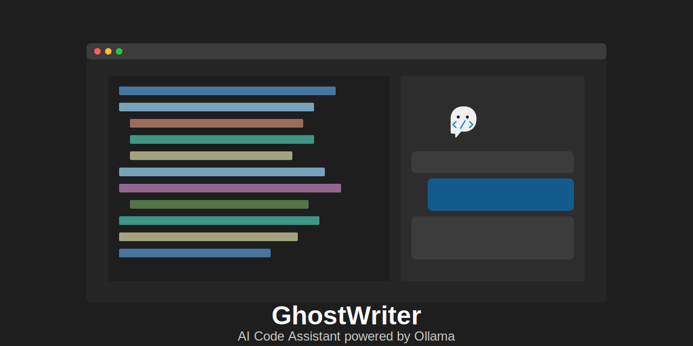

# GhostWriter



GhostWriter is a VS Code extension that provides AI-powered code assistance using Ollama models.

## Features

- AI code generation and suggestions using local Ollama models
- Customizable system prompts to control the AI's behavior
- Chat interface similar to Cursor's AI assistant
- Code insertion directly into your editor
- Support for multiple Ollama models

## Requirements

- [Ollama](https://ollama.ai) must be installed and running locally
- A compatible AI model must be pulled in Ollama (e.g., llama3, codellama, etc.)

## Development

### Building the Extension

The GhostWriter extension includes a smart build script that automatically determines the appropriate version increment based on git commit messages:

```bash
./build.sh [OPTIONS]
```

**Smart Version Management:**
- Analyzes git commit messages to determine version increment type
- Major version: Commits with "BREAKING CHANGE" or "!:"
- Minor version: Commits with "feat:" or "feature:"
- Patch version: All other changes (fixes, docs, etc.)
- Release candidate: Commits with "rc" or "release candidate"

**Options:**
- `-h, --help` - Show help message
- `-t, --type TYPE` - Force version increment type: auto, patch, minor, major, rc
- `-c, --clean` - Clean all previous builds
- `-k, --keep NUM` - Number of previous versions to keep (default: 1)
- `-m, --manual` - Disable automatic version determination

**Examples:**
```bash
./build.sh                      # Auto-determine version from git commits
./build.sh -t patch             # Force patch version increment (0.0.1 -> 0.0.2)
./build.sh -t minor             # Force minor version increment (0.0.1 -> 0.1.0)
./build.sh -t major             # Force major version increment (0.0.1 -> 1.0.0)
./build.sh -t rc                # Create release candidate (0.0.1 -> 0.0.1-rc.1)
./build.sh -k 3                 # Keep 3 previous versions
./build.sh -c                   # Clean all previous builds
```

The script also handles release candidates properly, allowing you to create and finalize pre-releases for testing.

## Installation

### From VS Code Marketplace (Coming Soon)

Search for "GhostWriter" in the VS Code marketplace and click install.

### From Source

1. Clone this repository
2. Run `npm install` to install dependencies
3. Run `npm run compile` to build the extension
4. Press F5 to launch a new VS Code window with the extension loaded

## Publishing

This extension uses GitHub Actions to automatically publish new versions to the VS Code Marketplace when a new release is created.

### Prerequisites for Publishing

1. Create a Personal Access Token (PAT) for the VS Code Marketplace:
   - Go to https://dev.azure.com/
   - Create or use an existing organization
   - Generate a Personal Access Token with the "Marketplace publishing" scope

2. Create a PAT for the Open VSX Registry (optional):
   - Go to https://open-vsx.org/
   - Create a namespace and token

3. Add the tokens as secrets in your GitHub repository:
   - Go to your repository's Settings > Secrets > Actions
   - Add `VSCE_PAT` with your VS Code Marketplace token
   - Add `OPEN_VSX_PAT` with your Open VSX token (optional)

### Publishing Process

1. Create a new release on GitHub
2. The workflow will automatically:
   - Build and package the extension
   - Publish it to the VS Code Marketplace
   - Publish it to the Open VSX Registry (if configured)

You can also manually trigger the publishing workflow from the Actions tab and optionally specify a version.

## Usage

1. Make sure Ollama is running locally with your preferred model pulled
2. Open the GhostWriter sidebar in VS Code
3. Start typing in the chat input to generate code or get programming assistance
4. Use the "Insert Code" button to add code snippets directly to your editor
5. Customize the system prompt and model using the GhostWriter commands

## Available Commands

- `GhostWriter: Start Chat` - Opens the chat interface
- `GhostWriter: Set AI Model` - Change the Ollama model to use
- `GhostWriter: Set System Prompt` - Customize the system prompt

## Extension Settings

This extension contributes the following settings:

- `ghostwriter.ollamaUrl`: URL for the Ollama API (default: http://localhost:11434)
- `ghostwriter.model`: Default model to use for code generation
- `ghostwriter.systemPrompt`: System prompt for the AI model

## Troubleshooting

- If you see "Error: Could not generate response", make sure Ollama is running and the selected model is pulled
- Run `ollama list` in the terminal to see available models
- Run `ollama pull llama3` (or other model name) to download a model 